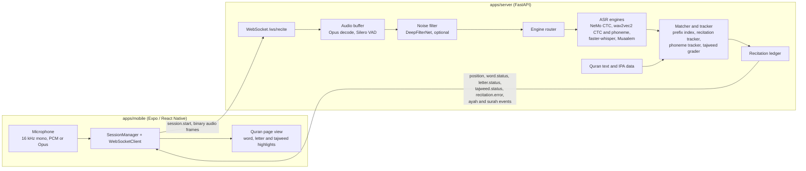

# Quran Recitation

Real-time Quran recitation tracking with tajweed feedback. The mobile app streams
microphone audio to a Python server while you recite. The server works out where
you are in the Quran, follows you word by word and letter by letter, and sends
back live feedback: current position, word and letter correctness, tajweed
grades and recitation errors. The app highlights all of this on the Quran page.

## Architecture



A session starts with a `session.start` JSON message (sample rate, encoding
`pcm_s16le` or `opus`, and optionally a surah and ayah). Binary audio frames
follow. Without a starting ayah, the tracker first locates the recitation
through a prefix index over the Quran text, then switches to tracking. During
tracking a CTC or phoneme engine drives the word position. If Muaalem is
enabled, it also runs per completed word and per completed ayah to produce
detailed letter statuses, tajweed grades and recitation errors. The server
message types are defined in `apps/server/app/ws/protocol.py`.

## Repository layout

```
apps/
  mobile/   Expo Router app (TypeScript, NativeWind, Zustand)
  server/   FastAPI server (Python 3.11+)
    app/
      api/            REST endpoints under /api/v1 (health, surahs, ayahs)
      ws/             WebSocket endpoint, session loop and message protocol
      audio/          Opus decoding and noise reduction
      transcription/  audio buffer with VAD, ASR engines, engine router, forced alignment
      matching/       prefix index, tracker, phoneme tracker, tajweed grader, ledger
      quran/          corpus, normalizer, IPA converter, tajweed rules, qiraat
    scripts/          data download and IPA generation
    tests/            pytest suite (unit, integration, benchmark)
turbo.json            Turborepo tasks (dev, build, test, lint)
```

## Server

Requires Python 3.11 or newer. The commands below were verified with Python 3.12.

```bash
cd apps/server
python3.12 -m venv .venv
source .venv/bin/activate
pip install torch torchaudio --index-url https://download.pytorch.org/whl/cpu
pip install -e ".[dev]"
```

The first `pip install` line is optional. It installs CPU-only PyTorch, the
same setup CI uses. Without it pip installs the default PyTorch build, because
`silero-vad` depends on torch.

### Data

- `app/quran/data/quran_uthmani.json` (Quran text) is committed. To refetch it,
  run `python scripts/fetch_quran_data.py`.
- `app/quran/data/ipa_hafs.json` (about 46 MB) is generated rather than committed:

  ```bash
  python scripts/generate_ipa.py
  ```

  This takes a few seconds and writes IPA data for all 6236 ayahs. The server
  starts without it but logs a warning, and the phoneme tracker is not used
  unless the file is present.

### ASR engines and models

Engines are selected with `QURAN_*` environment variables, or with an `.env`
file in `apps/server` (see `apps/server/.env.example`). Each engine needs its
pip extra and its model weights:

| Setting | Values (default first) | Extra | Default model |
|---|---|---|---|
| `QURAN_CTC_ENGINE_TYPE` | `nemo`, `wav2vec2`, `whisper`, `tarteel` | `nemo`, `wav2vec2`, `whisper` | `QURAN_CTC_MODEL=nvidia/stt_ar_fastconformer_hybrid_large_pc_v1.0` |
| `QURAN_PHONEME_ENGINE_TYPE` | `espeak`, `nrshoudi`, `muaalem` | `wav2vec2`, `muaalem` | `QURAN_PHONEME_MODEL=facebook/wav2vec2-xlsr-53-espeak-cv-ft` |
| `QURAN_NOISE_REDUCTION_ENABLED` | `true`, `false` | `deepfilter` | DeepFilterNet |

Other model settings, from `app/config.py`:

- `QURAN_WHISPER_MODEL=openai/whisper-large-v3-turbo` (engine `whisper`)
- `QURAN_TARTEEL_MODEL=tarteel-ai/whisper-base-ar-quran` (engine `tarteel`)
- `QURAN_NRSHOUDI_MODEL=nrshoudi/wav2vec2-large-xls-r-300m-Arabic-phonemeIPA`
- `QURAN_MUAALEM_MODEL=obadx/muaalem-model-v3_2`
- `QURAN_QURAN_PHONEME_MODEL=TBOGamer22/wav2vec2-quran-phonetics`

Notes:

- The default setup (NeMo CTC plus the espeak phoneme engine) needs both
  `pip install -e ".[nemo,wav2vec2]"` and both models.
- When you switch `QURAN_CTC_ENGINE_TYPE` to `wav2vec2`, also set `QURAN_CTC_MODEL`
  to a wav2vec2 checkpoint, for example `jonatasgrosman/wav2vec2-large-xlsr-53-arabic`
  from `.env.example`. The default value is the NeMo model.
- `apps/server/README.md` notes that `quran-muaalem` needs `numpy>=2.2.6`, while
  `pyctcdecode` (in the `wav2vec2` extra) pins `numpy<2.0`, so the two cannot share
  one environment.
- To send Opus audio (`EXPO_PUBLIC_AUDIO_ENCODING=opus` in the app), install the
  `opus` extra (`opuslib`).

The repository has no model download script. The wav2vec2-based engines load
with `local_files_only=True`, and Muaalem loads with `HF_HUB_OFFLINE=1`, so their
weights must already be on disk: either in the local Hugging Face cache, or in
`QURAN_MODELS_DIR`. For every engine, when `QURAN_MODELS_DIR` is set and
`<QURAN_MODELS_DIR>/<model id>` is a directory, that directory is passed to the
engine instead of the model ID.

### Run

```bash
cd apps/server
source .venv/bin/activate
uvicorn app.main:app --host 0.0.0.0 --port 8000
```

Startup loads the configured engines, so it fails until their extras and model
weights are installed. With only `.[dev]` installed, startup stops at
`ModuleNotFoundError: No module named 'nemo'`. Once running:

- `GET /api/v1/health`
- `GET /api/v1/surahs` and `GET /api/v1/surahs/{id}/ayahs`
- `WS /ws/recite`

`yarn workspace server dev` runs uvicorn from `apps/server/.venv` on port 8001.
The app defaults to port 8000, so set `EXPO_PUBLIC_WS_URL` to match whichever
port you use.

## Mobile app

The workspace uses Yarn 4 with the `node-modules` linker. The lockfile installs
unchanged with Yarn 4.10.3.

```bash
corepack enable
corepack prepare yarn@4.10.3 --activate
yarn install --immutable
cp apps/mobile/.env.example apps/mobile/.env
yarn workspace mobile start
```

In `apps/mobile/.env`, point `EXPO_PUBLIC_WS_URL` at the server, for example
`ws://<your-computer-ip>:8000/ws/recite` when running on a phone. Also set
`EXPO_PUBLIC_AUDIO_ENCODING` to `pcm_s16le` or `opus`.

The app records audio with `@siteed/expo-audio-studio`, which is set up as an
Expo config plugin. That means it needs a development build rather than Expo Go:

```bash
yarn workspace mobile android
yarn workspace mobile ios
```

These run `expo run:android` and `expo run:ios`, and need the Android SDK or Xcode.

## Tests

Server, from `apps/server`:

```bash
python -m pytest -m "not integration and not benchmark"
```

| Environment (Python 3.12, CPU torch, no model files) | Passed | Failed | Skipped |
|---|---|---|---|
| `pip install -e ".[dev]"` | 222 | 2 | 16 |
| `pip install -e ".[dev,wav2vec2]"` | 231 | 2 | 7 |

The numbers are for the full `tests/` directory:

- The 9 tests in `tests/test_ctc_beam_decode.py` are skipped when `transformers`
  is not installed.
- The 3 `integration` and 4 `benchmark` tests need `ffmpeg`, network access to
  download reference recitations (`scripts/download_test_audio.py` caches them
  in `tests/fixtures/audio/`), and the ASR models.
- Two tests in `tests/test_improvements.py` currently fail against the tracker's
  behaviour (`TestConsecutiveFailures::test_mistake_after_threshold` and
  `TestRemainingLettersNotSure::test_remaining_letters_are_not_sure`). CI
  deselects them until they are updated.

Mobile (4 suites, 32 tests):

```bash
yarn workspace mobile test
```

## CI

`.github/workflows/ci.yml` runs on pull requests and on pushes to `main`. It has
two jobs:

- Server tests on Python 3.12, with CPU torch and the `dev` and `wav2vec2` extras,
  excluding the `integration` and `benchmark` markers.
- Mobile Jest tests with Yarn 4.10.3.

Neither job needs model files.
